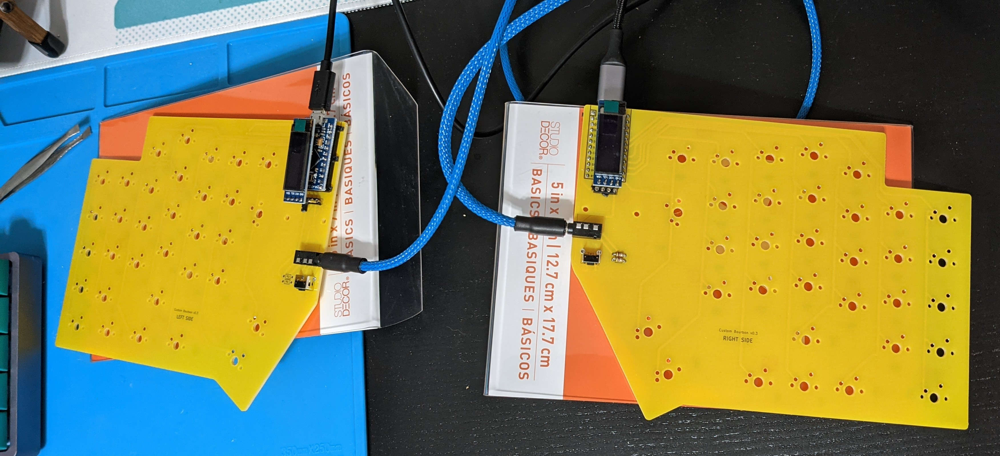
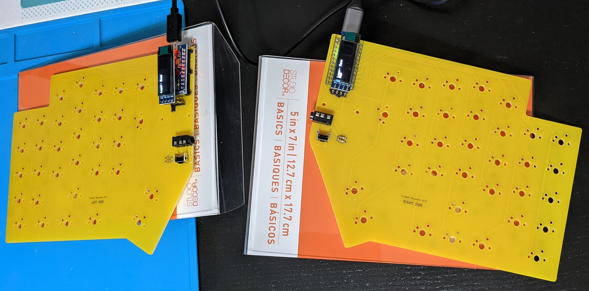
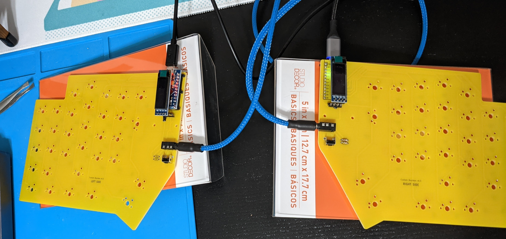
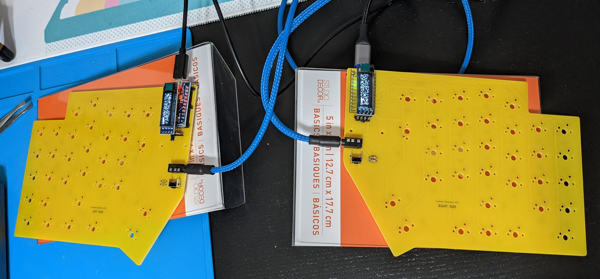
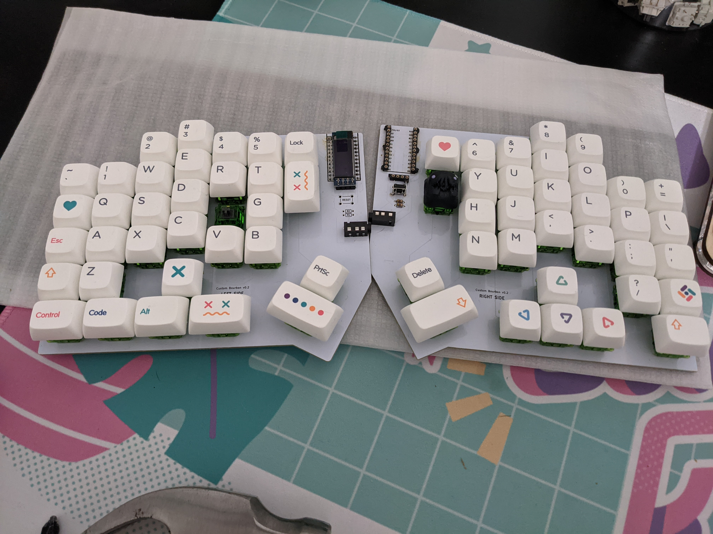
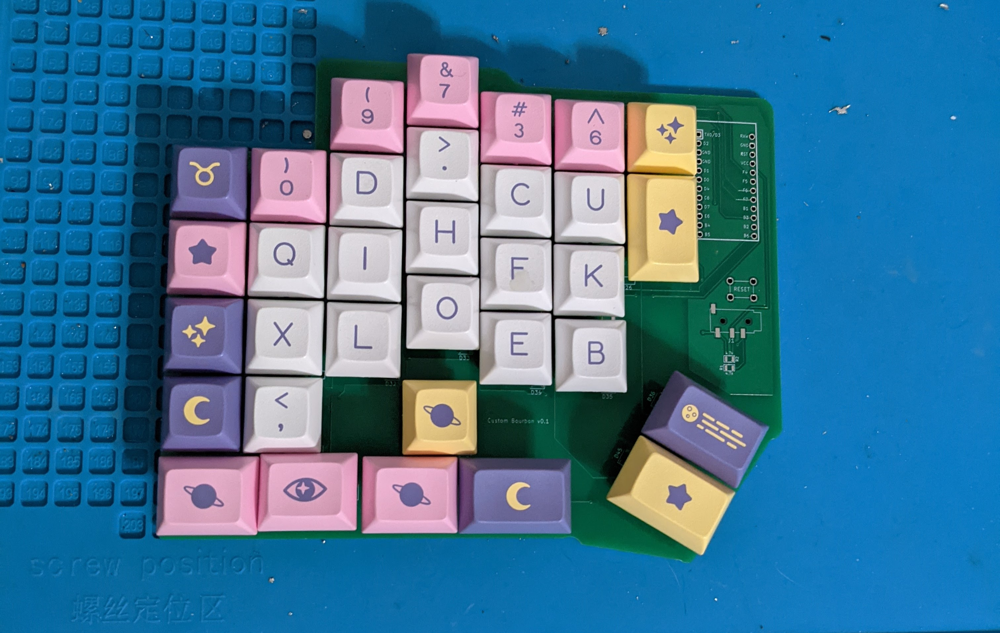
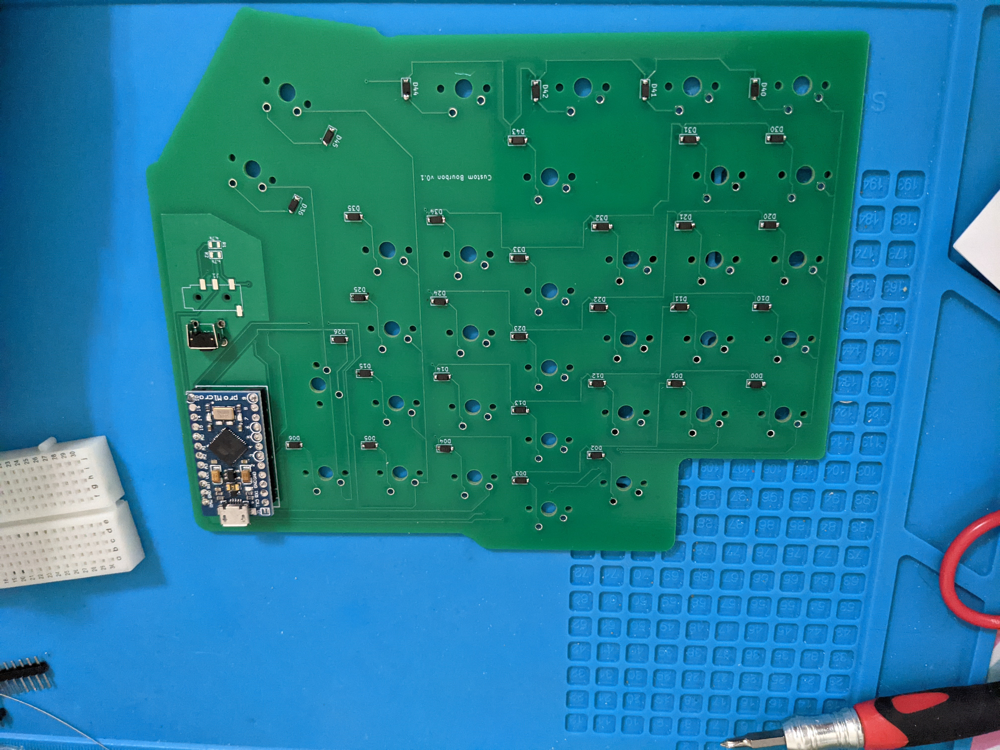
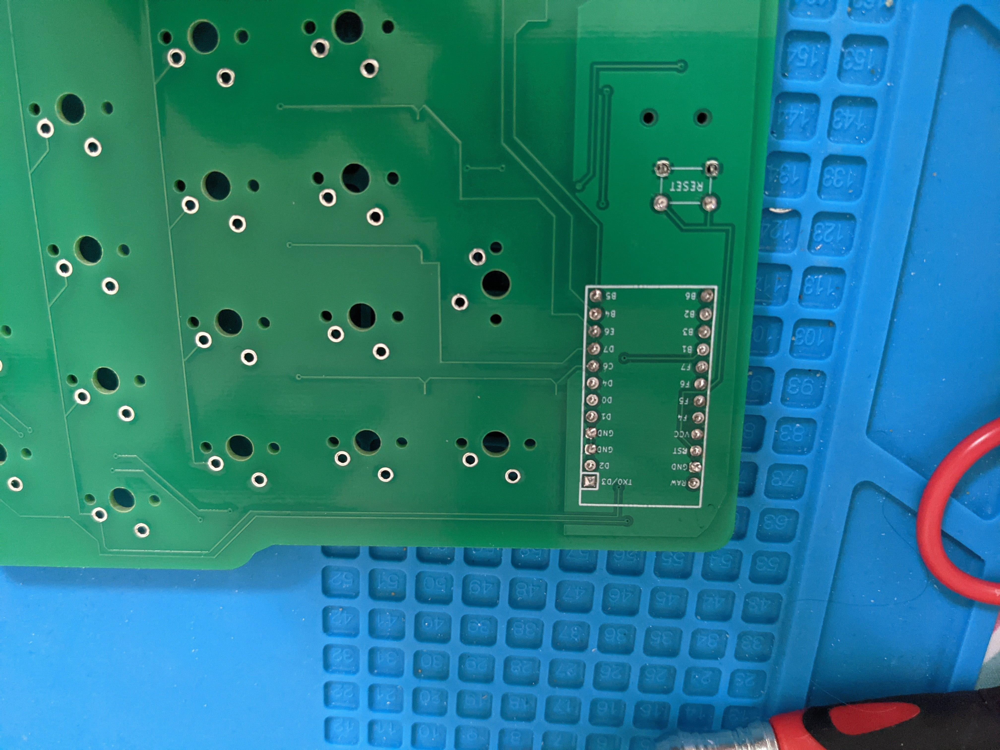
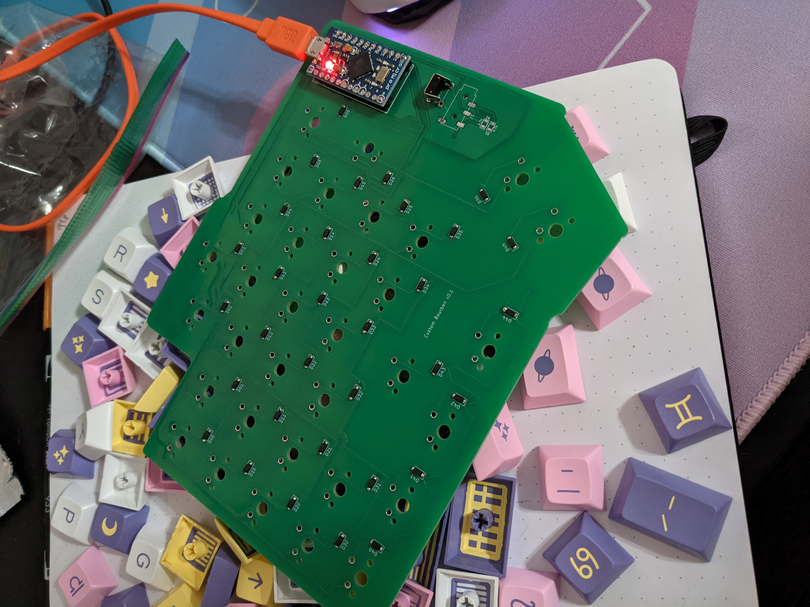

# bourbondox

`pcb_rev1` folder contains the KiCAD pcb files for v0.1 (received 2021-07-02)

`pcb_rev2` folder contains the KiCAD pcb files for v0.2 (received 2021-07-06)

`pcb_rev3` folder contains the KiCAD pcb files for v0.3 (received 2021-07-19)

`firmware` folder contains the qmk firmware files

## Description of issues

### v0.1

* Only had one side printed. Diodes were mistakenly put on the front of the PCB in my schematic when they should be on the back.
* Soldered on reset button, promicro controller, and diodes.
* Tested each switch with tweezers. 
* All switches in columns 0, 1, 2, 3, and 4 worked as expected.
* All switches in columns 5 and 6 failed to register. Reset button failed to work.

### v0.2

* Had both sides printed this time. Completely redid the routing from scratch because I wasn't happy with the first version. Did all this and ordered the v0.2 prototypes before I had even received and tested v0.1.
* Soldered reset buttons, TRRS jacks, OLED screens, promicro controllers, diodes, and switches on both sides. Soldered resistors on right side only.
* Reset buttons still didn't work.  But... On each side, when plugged in alone (not connected to other half): All switches worked as expected. Both OLED screens worked as expected.
* When the sides are connected via TRRS cable, switches and OLED screens stopped working. This led me to believe there was a problem with the routing with the TRRS jacks. I ruled out a problem with the cable since I tried two different TRRS cables, both of which worked fine with two other split keyboards.
* Stagger on left hand felt extremely comfortable but right hand was unnatural.

### v0.3

* Changed the footprints on the PCB for the TRRS jacks and reset switches. Rerouted those components on the schematic.
* Reduced the stagger by a small bit on the left side. Reduced the stagger by a lot on the right side.
* Reset buttons work now, on both halves. 
* When it comes to testing the TRRS connection, there are multiple outcomes depending on configuration:
    * If right half has Elite-C and it is connected via USB-C cable to the computer, no switches register and OLEDs are blank.
    * If left half has ProMicro and it is connected via micro USB cable to the computer, no switches register, but the OLEDs each show the same garbled output (first few letters are clear and correct but the rest is nonsense).
    * If NOT connected via TRRS, but each half is connected via its respective USB cable directly to the computer, then OLED screens work as expected and all switches register as expected with tweezers.

## v0.3 photos

*Not plugged in*

*Halves are NOT connected, each half is connected to computer via its own cable. OLEDs, switches, and reset buttons work as expected*

*TRRS connecting the halves, connected to computer via USB-C cable plugged into Elite-C controller on right half of keyboard (controller power buttons light up, but no OLEDs and no switches register)*

*TRRS connecting the halves, connected to computer via micro USB cable plugged into ProMicro controller on left half of keyboard (controller power buttons light up, but no switches register; OLEDs light up but output is garbled)*

## v0.2 photo

*Everything's soldered, but it's not plugged in*

## v0.1 photos

*No soldering done yet, just placing switches and keycaps to verify fit.*

*Soldered diodes, promicro, and reset button to the front. Yes, I know the diodes are supposed to be on the back of the PCB. This is fixed for v0.2.*

*View of the soldering for the promicro on the back of the PCB.*

*Promicro is flashed and soldered. Ready for testing!*

# Acknowledgements

Thank you to ai03 and masterzen for your extensive keyboard pcb design tutorials posted online as resources for the community.

Thank you to the designers of the redox, lily58, and corne-cherry for sharing your work as open source. These were inspirational and helpful resources during my design of this keyboard.

Special thanks to the Keycraft Collective discord community, especially users astra and matthewdias, for their encouragement, feedback, input, and troubleshooting.