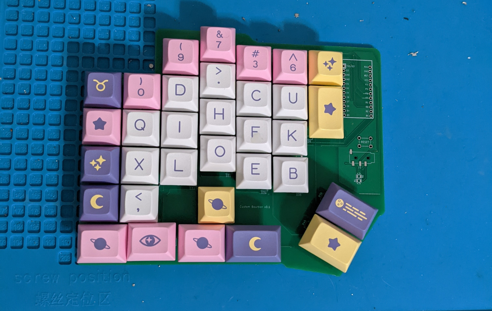
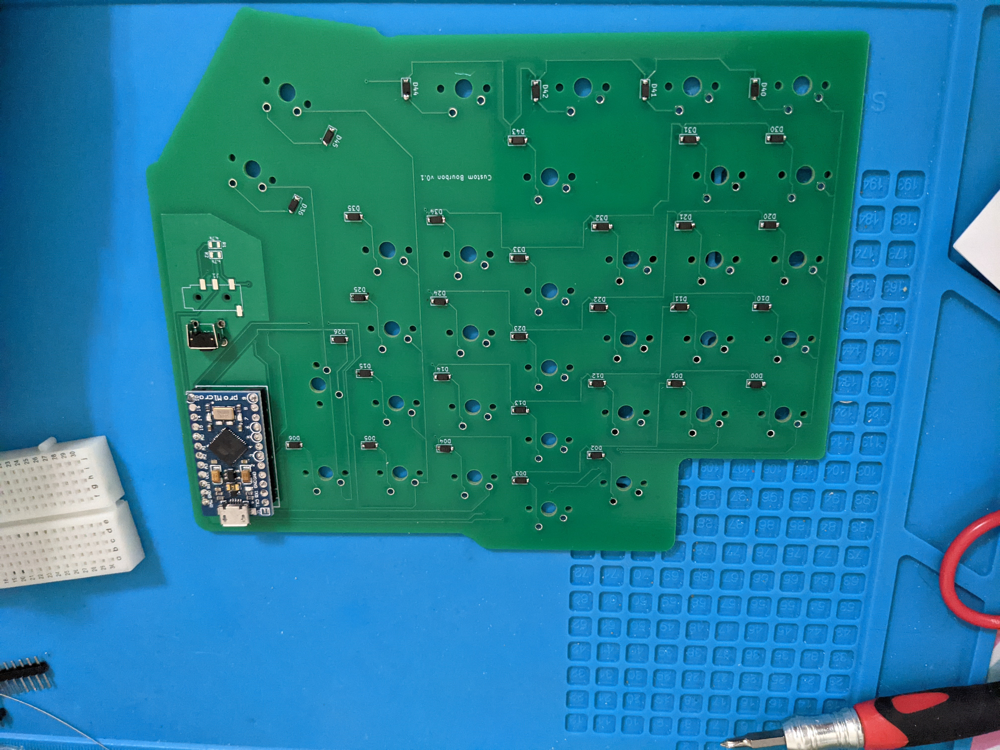
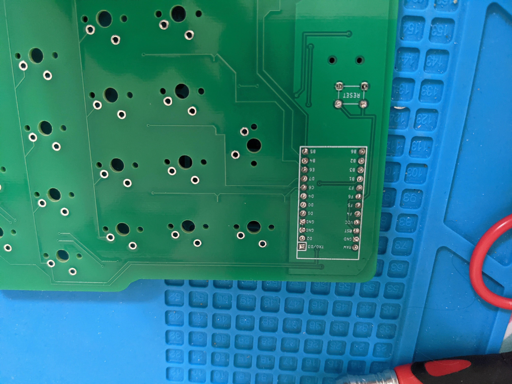
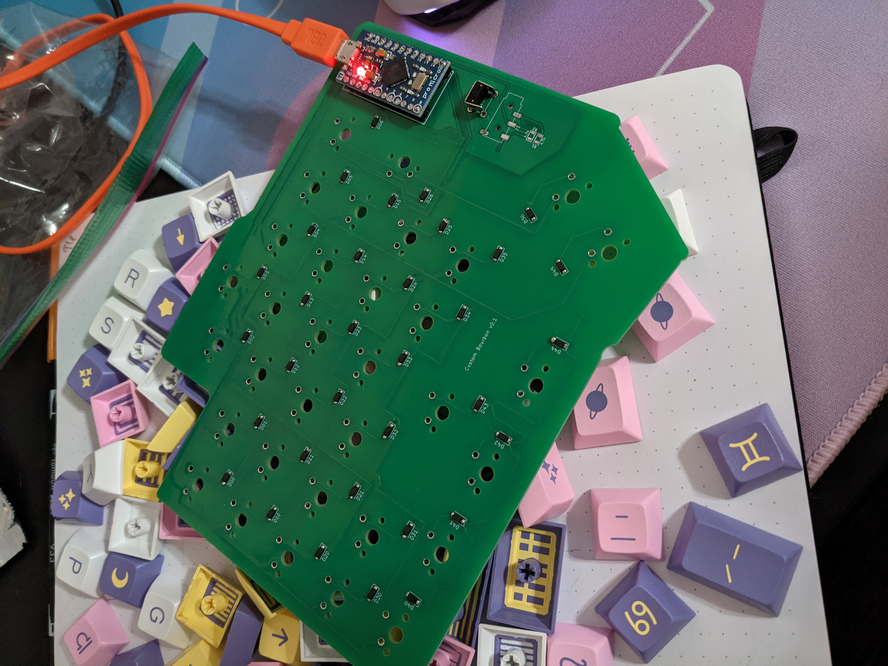

# bourbondox

`pcb_rev1` folder contains the KiCAD pcb files for v0.1(received 2021-07-02)

`pcb_rev2` folder contains the KiCAD pcb files for v0.2 (en route)

`firmware` folder contains the qmk firmware files

## v0.1 photos

*No soldering done yet, just placing switches and keycaps to verify fit.*

*Soldered diodes, promicro, and reset button to the front. Yes, I know the diodes are supposed to be on the back of the PCB. This is fixed for v0.2.*

*View of the soldering for the promicro on the back of the PCB.*

*Promicro is flashed and soldered. Ready for testing!*

